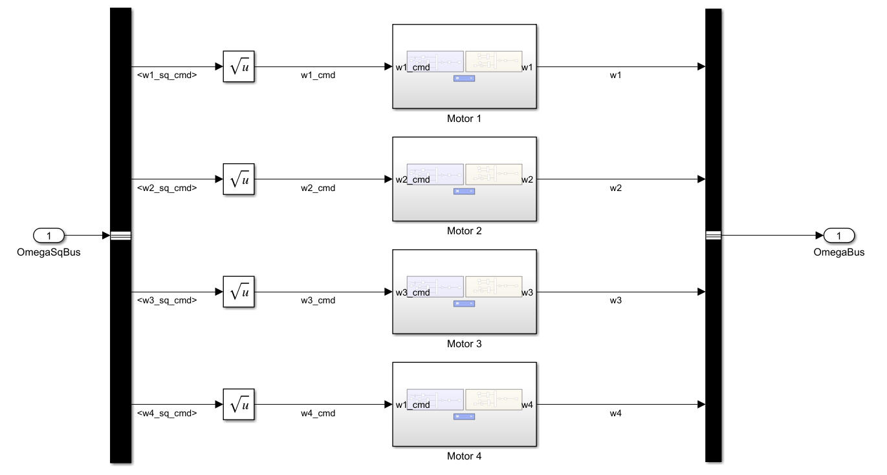
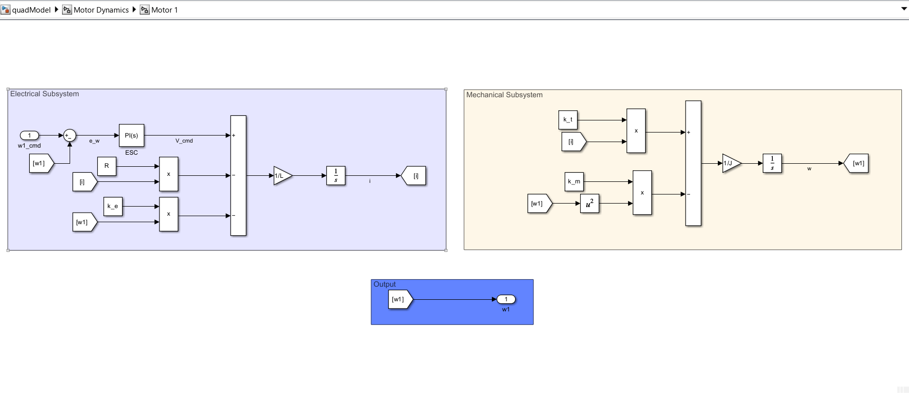

# Motor Dynamics

So The vehicle we took for simulation is PX4 Iris.

The motor used in the has the following specifications:

- 2212-920 KV class BLDC outrunner
- 3-phase Y-connected
- Powered from 3S-4S LiPo

Typical real motors in this class:

- DJI 2212
- Sunnysky X2212
- Generic 2212-920 KV

Let us model the motor dynamics for the quadcopter.

The above shown image is the model inside the Motor Dynamics Block in the top model of the simulation.

The block takes the input $\omega_{cmd}^2$ and outputs the actual angular velocity $\omega$ in rad/s.

Let us look what is inside a motor block (let us Motor1 block)

Inside the Motor1 block we can see two systems. One is the electrical system and the other is mechanical system.

Basically the BLDC motor is an armature controlled DC motor. So we use the equations of armature controlled DC motor for modelling the dynamics of this motor.

The equation used to model the Electrical system is as follows:

$$
    \frac{di}{dt} = \frac{1}{L}(V_{cmd}-Ri-k_e\omega)
$$

On integrating the above equation we get current $i$

In the above equation the terms L and R are constant, but PX4 Gazebo model does not publish R,L, so we must estimate from physics + datasheets (this is standard practice).

## Estimating Resistance (R)

### What is R here

In the simplified motor equation:

$$
    \frac{di}{dt} = \frac{1}{L}(V_{cmd}-Ri-k_e\omega)
$$

R is the equivalent phase resistance senn by the controller. (ESC + motor phase lumped into a single variable)

#### Typical datasheet values

For 2212 motors:

|Motor|Phase Resistance $\Omega$|
|--------|-------------|
|DJI 2212|0.08 - 0.12|
|Sunnysky X2212|0.07 - 0.09|
|Generic 2212|0.1 (tpical)|

From this table we can estimate a reasonable value for R as 0.10.

$$
    R\approx0.10
$$

## Estimating Inductance (L)

### What inductance is this

- Effective phase inductance
- Governs current rise time
- Dominates high-frequency dynamics

#### Typical inducatnce range (2212 motors)

Measured values from lab tests:

|Motor|Phase Inducatnce $\mu H$|
|--------|-------------|
|DJI 2212|30 - 50|
|Sunnysky X2212|40|
|Generic 2212|35-60|

From this table we can estimate a reasonable value for L as $40 \mu H$.

$$
    L\approx 40\mu H
$$

## ESC - As a PI Controller

In the Motor1 subsystem we can see a PI controller block which is a model for the Electronic Speed Controller.

The job of this controller is not flight control but its job is to make actual motor speed $\omega$ track commanded speed $\omega_{cmd}$ quickly and stably.

- The PI controlled output is voltage $V_cmd$

There will be gains for this PI controller namely $K_p$ and $K_i$, So we need to estimate $K_p$ and $K_i$.