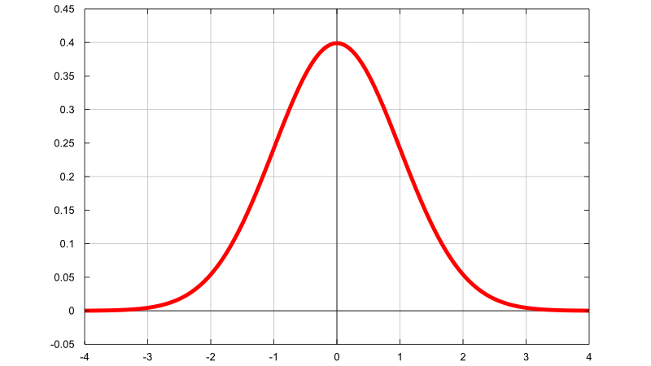

# Kalman Filter

## The Basics

### Why do we need a filter?

Imagine you're trying to track a friend's location in a foggy park using only glimpses of their flashlight. The fog blurs your view (noise), and you only see flashes occasionally (measurements). Your brain predicts where they'll be next based on their walking pattern (model), then corrects when you see a flash. The Kalman Filter does exactly this mathematically for computers: it estimates "hidden truths" (like position) from imperfect, noisy data.

**Key Idea: Real-world data is always noisy-sensors glitch, models aren't perfect. KF "filters" out the junk to give the best possible guess.**

### What is noise?

- Noise is any unwanted random variation in data. Like static on radio: it muddles the signal (true) you care about.
    - **Signal**: The true underlying pattern (e.g., a car's exact speed).
    - **Noise**: Random errors (e.g., wind jiggling the speedometer).
- Without filtering, noise makes estimates jumpy and useless. KF smooths it intelligently.

### What is White Noise? (The "Random Buzz" KF Assumes)

- White noise is a specific type of noise: **random, uncorrelated, and zero-mean** (averages to zero over time).

    - Why "white"? Like white light (all frequencies equal), it has equal power across all times/frequencies-no patterns, just flat randomness.

    - **Key Properties**
            - Zero mean: $\mathbb{E}[w] = 0$
            - Uncorrelated: Future noise doesn't depend on past noise. If $w_k$ is noise at time $k$, then $\mathbb{E}[w_kw_{k-1}] = 0$ (no memory)
            - Stationary: Same statistics (variance) at all times.

- **Symbol** : We donte white noise as $w_k$ or $v_k$ (process or measurement noise).

- **Gaussian White Noise**: KF assumes noise is Gaussian (bell-shaped). Why? Math works out nicely (more below).

## Probability Basics - The Language of Uncertainty

KF is built on probability: It doesn't give a single "answer" but a distribution (range of possibilities) witha a "best guess" and uncertainty.

### The Normal (Gaussian) Distribution and $\mathcal{N}$

