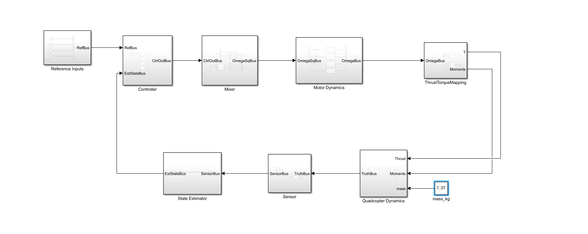

# Quadcopter simulation using Jostick integrated with Arduino UNO

I was thinking, Is it possible to give input to a quadcopter using an analog joystick which we use for simple IOT projects. I watched youtube videos where they use a jostick to give input to flights or drones in simulation, so why not use this. I thought integrating this with Matlab and Simulink would be fun.

I had a joystick and a Arduino UNO with me, so I started to work on it. 

## Step 1: Choosing a quadcopter

- The first step is to choose a quadcopter for simulation - I chose PX4 Iris+.

Parameters of the quadcopter

| Parameter| Unit |Value|
|---|---|---|
| Mass | kg | 1.37 |
| Roll Inertia ($I_{xx}$) | $kgm^2$ | 0.0219|
| Pitch Inertia ($I_{yy}$) | $kgm^2$ | 0.0109 |
| Yaw Inertia ($I_{zz}$) | $kgm^2$ | 0.0306 |
| Arm Length | $m$ | 0.18 |
| Propeller Diameter | $m$ | 0.254 |
| Thrust Coefficient $k_T$ | $N/(rad/s)^2$ | $1.3\times10^{-5}$ |
| Moment Coefficient $k_m$ | $N/(rad/s)^2$ | $1.1\times10^{-6}$ |

## Step 2 : Build the Simulink Model

The above image shows the top level model of the Quadcopter. The blocks involved in the model are as follows:

1. Reference Inputs
2. Controller
3. Mixer
4. Motor Dynamics
5. Thrust and Torque Mapping
6. Rotation Matrix
7. Quadcopter dynamics
8.  Sensors
9. State Estimator
